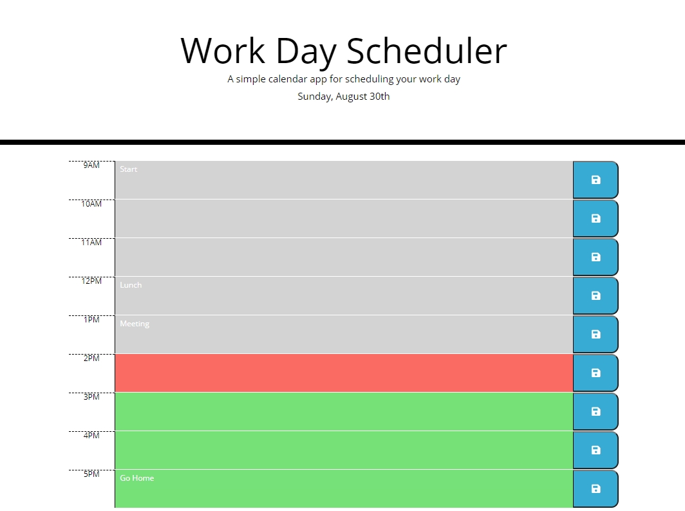

# Work Day Scheduler
## Table of Contents
- [Summary](#summary)
- [HTML Approach](#html-approach)
- [CSS Technologies](#css-technologies)
- [Javascript](#javascript)
- [Deployed Application](#deployed-application)
- [Screenshot](#screenshot)
- [Animated Screenshot](#animated-screenshot)

## Summary
In this project, a schedule is shown for the current day's hourly tasks. The tasks for the times 9AM to 5PM inclusive are displayed. Tasks can be edited and saved with the save button, so that if the browser is refreshed the data is not lost. The current hour is displayed in red, all hours in the future are displayed in green, and all hours in the past are displayed in gray. A timer runs in the background and refreshed the background colors at the top of every hour.

## HTML Approach
- Bootstrap grid is used, with all rows and columns produced in Javascript 

## CSS Technologies
- CSS template provided was used with minor adjustments to the .saveBtn class to make the disk image larger

## Javascript
- jQuery and Moment.js libraries used
- Array of objects used to track times and their associated tasks
- All HTML for rows and columns was generated in Javascript
- Moment.js used to display current date at top of HTML
- Moment.js used to determine if each row was before, during, or after the current hour so the background color could be displayed correctly
- A timeout was used to determine how much time was left before the top of the next hour so the schedule colors could be adjusted
- A time interval was used after the initial timeout to adjust colors on an hourlys basis afterwards
- jQuery was used to determine the textarea to save that corresponded with the save button

## Deployed Application
- The web page can be found at [https://jesseparent.github.io/workday-scheduler/](https://jesseparent.github.io/workday-scheduler/)

## Screenshot
- The screenshot of the final work: 

## Animated Screenshot
- The animated screenshot showing all functionality and effect on backround colors during an hour change: 
